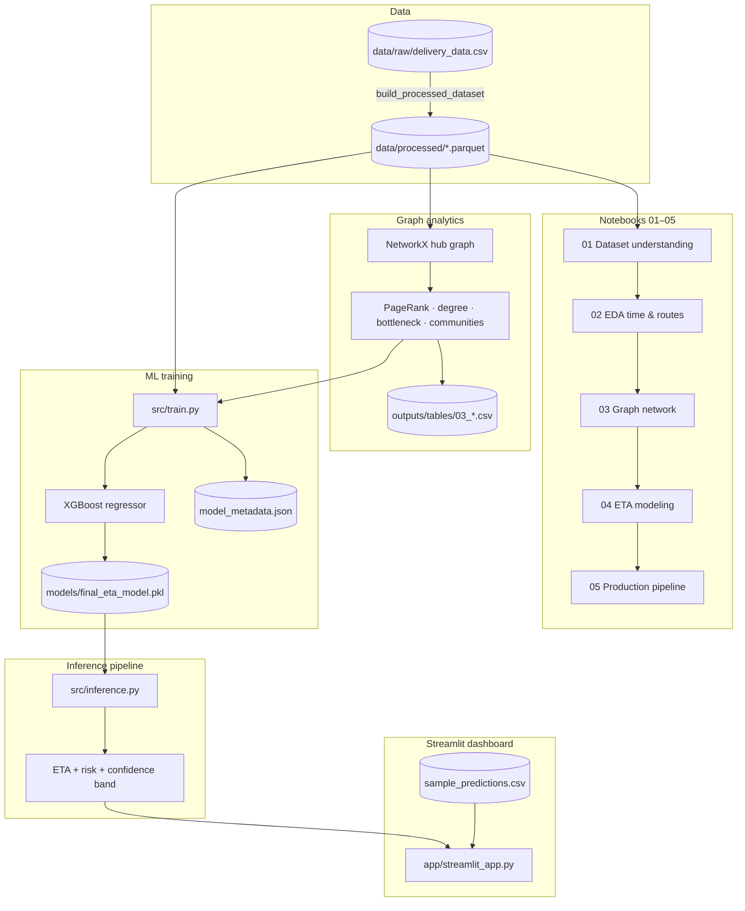

# Delivery ETA Intelligence

**Graph-aware machine learning platform for delivery ETA prediction, network bottleneck detection, and logistics risk monitoring.**

End-to-end portfolio project: exploratory analytics → graph feature engineering → production XGBoost training → real-time inference API → enterprise Streamlit operations dashboard.

[](https://www.python.org/)
[](LICENSE)
[](app/streamlit_app.py)

---

## Business problem

Last-mile and line-haul logistics teams need **accurate ETAs** that reflect real network congestion—not just routing-engine baselines. Underestimating delay drives SLA breaches; overestimating erodes capacity planning.

This system:

- Predicts **segment-level delivery time** using OSRM baselines, trip context, and **hub-level graph stress**
- Flags **operational risk** (LOW → CRITICAL) from bottleneck scores and ETA vs OSRM divergence
- Surfaces **hot corridors and hubs** for control-tower style monitoring

---

## Results (held-out trips)

| Metric | Value |
|--------|-------|
| **Test MAE** | ~44.2 minutes |
| **Test R²** | ~0.968 |
| **Test RMSE** | ~111.9 minutes |
| **Features** | 24 (routing + temporal + graph) |
| **Split** | Trip-level (`trip_uuid`) to prevent leakage |

Metrics are stored in [`models/model_metadata.json`](models/model_metadata.json) after training.

---

## Architecture



**Design principles**

- **Trip-level train/test split** — no segment leakage across trips
- **No leaky targets** in features (e.g. `delay_ratio` excluded from production features)
- **Graph features** joined at hub level; same tables used in training and inference
- **Single production bundle** — model + preprocessor + graph tables in one artifact

See also [`docs/ARCHITECTURE.md`](docs/ARCHITECTURE.md).

---

## Tech stack

| Layer | Tools |
|-------|--------|
| Data | pandas, PyArrow (Parquet) |
| Graph | NetworkX (centrality, communities, bottleneck scoring) |
| ML | scikit-learn, XGBoost, joblib |
| App | Streamlit, Plotly |
| Analysis | Jupyter, matplotlib, seaborn, SHAP (notebooks) |

---

## Dashboard features

Enterprise dark-theme ops console (`streamlit run app/streamlit_app.py`):

| Tab | Capabilities |
|-----|----------------|
| **Overview** | KPIs, operational risk gauge, route mix, ETA distribution, risk & congestion charts |
| **Risk analytics** | Predicted vs OSRM scatter, hour×route heatmap, risky lane leaderboard, corridor table |
| **Network intelligence** | Hub/lane summary, bottleneck chart, congestion hotspots |
| **Predictions** | Live sidebar inference, confidence band, graph bottleneck metrics |
| **Monitoring** | SLA signals, critical lanes, risk breakdown, ops playbook |

### Screenshots

> Add captures under [`demos/screenshots/`](demos/screenshots/) and uncomment below.

<!--


-->

---

## Project structure

```
delivery-eta/
├── app/                    # Streamlit dashboard (entry point)
├── src/                    # Production ML & graph modules
│   ├── config.py           # Paths, constants, risk thresholds
│   ├── features.py         # Feature engineering
│   ├── graph_features.py   # NetworkX graph → hub features
│   ├── preprocessing.py    # Fit/transform for train & inference
│   ├── train.py            # Training & model bundle I/O
│   ├── inference.py        # ETAInferencePipeline & predict_eta()
│   ├── dashboard_utils.py  # Plotly charts & KPI tables
│   └── dashboard_theme.py  # Enterprise UI theme
├── notebooks/              # 01–05 analytics & walkthrough
├── scripts/                # CLI: data build, train, validators
├── models/                 # Trained artifacts (see models/README.md)
├── data/                   # Raw & processed data (gitignored)
├── outputs/                # Figures, tables, batch predictions
├── demos/                  # README screenshots for portfolio
├── docs/                   # Setup & architecture notes
├── tests/                  # Smoke tests
├── requirements.txt        # Production dependencies
└── requirements-dev.txt    # Notebooks & EDA extras
```

---

## Quick start

### 1. Clone & environment

```bash
git clone https://github.com/YOUR_USERNAME/delivery-eta-intelligence.git
cd delivery-eta-intelligence
python -m venv .venv

# Windows
.\.venv\Scripts\activate

# macOS / Linux
source .venv/bin/activate

pip install -r requirements.txt
# Optional — notebooks & SHAP
pip install -r requirements-dev.txt
```

**Windows details:** [docs/SETUP_WINDOWS.md](docs/SETUP_WINDOWS.md)

### 2. Data

Place your logistics CSV at `data/raw/delivery_data.csv`, then:

```bash
python scripts/build_processed_dataset.py
```

### 3. Train production model

```bash
python scripts/train_production_model.py
```

Creates `models/final_eta_model.pkl` and updates `models/model_metadata.json`.

### 4. Run dashboard

```bash
streamlit run app/streamlit_app.py
```

For batch analytics without re-scoring, ensure `outputs/predictions/sample_predictions.csv` exists (generate via notebook **05** or batch inference).

---

## Production inference

```python
from src.inference import predict_eta, ETAInferencePipeline

# One-liner
result = predict_eta(
    source_center="IND000000ACB",
    destination_center="IND562132AAA",
    osrm_distance=120.0,
    trip_hour=10,
    route_type="FTL",
)
print(result["predicted_eta"], result["risk_level"])

# Reusable pipeline
pipe = ETAInferencePipeline()
out = pipe.predict_eta("IND000000ACB", "IND562132AAA", 120.0, 10, "FTL")
print(out.confidence_low, out.confidence_high)
```

---

## Notebook pipeline

| # | Notebook | Focus |
|---|----------|--------|
| 01 | `01_dataset_understanding` | Schema, quality, segment structure |
| 02 | `02_eda_time_and_routes` | Delays, FTL vs Carting, route patterns |
| 03 | `03_graph_network` | NetworkX graph, centrality, bottlenecks, Louvain |
| 04 | `04_eta_modeling` | Baselines, XGBoost, graph ablation, SHAP |
| 05 | `05_production_pipeline_and_dashboard` | End-to-end production workflow |

---

## Graph analytics

Hub-level directed graph built from lane aggregates:

- **PageRank** & **degree** — hub importance and connectivity
- **Betweenness-style bottleneck score** — flow-weighted stress
- **Louvain communities** — regional cluster membership
- **Derived features** — products, gaps, same-community flags

Exported in notebook 03 to `outputs/tables/03_*.csv` and embedded in the production model bundle.

---

## ML pipeline

1. **Features** — OSRM baselines, segment shares, cyclical hour encoding, route type dummies, graph hub features  
2. **Preprocessor** — median imputation, percentile clipping (fit on train only)  
3. **Model** — XGBoost regressor (`trip_uuid` holdout)  
4. **Risk layer** — rules on bottleneck scores + ETA/OSRM ratio (inference only)  
5. **Bundle** — `joblib` artifact with model, preprocessor, and graph tables  

---

## Validation scripts

```bash
python scripts/validate_graph_notebook.py
python scripts/validate_eta_modeling.py
python scripts/validate_production_inference.py
pip install pytest && pytest tests/ -q
```

---

## Future improvements

- [ ] Model registry & versioning (MLflow / DVC)
- [ ] Scheduled graph refresh from live TMS/WMS feeds
- [ ] REST API (FastAPI) wrapper around `ETAInferencePipeline`
- [ ] Drift monitoring on input features and residual MAE
- [ ] Map-based corridor visualization (deck.gl / Folium)
- [ ] Cloud deployment (Docker + Streamlit Community / AWS ECS)

---

## License

[MIT License](LICENSE) — free to use, modify, and showcase in portfolios with attribution.

---

## Author note

Portfolio ML engineering project demonstrating **end-to-end logistics intelligence**: graph analytics, leakage-safe modeling, production inference, and operations dashboard UX.
